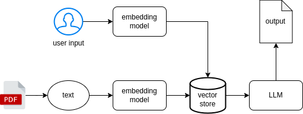

# Chatty ML Server

## Overview
챗봇 생성

## Architecture



## Skills
- Langchain
- FastAPI

## Usage
가상 환경 activate
```
source ./.env/bin/activate
```

필요한 패키지 다운로드
```
pip install -r requirements.txt
```

app 폴더로 이동
```
cd app
```

실행
```
python3 main.py
```
