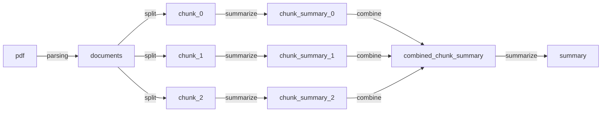
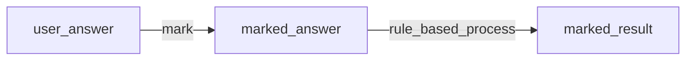

# WeQuiz ML Server
.
## Overview
1. 문서 요약
2. 문제 생성
3. 답안 채점

## Architecture

### Generate Summary



### Generate Quiz
to be continued...

### Generate Mark



## Skills
- Langchain
- FastAPI

## Usage

### local
가상 환경 activate
```
source ./.env/bin/activate
```

필요한 패키지 다운로드
```
pip install -r requirements.txt
```

app 폴더로 이동
```
cd app
```

API 앱 실행
```
uvicorn app:app --reload
```

### Docker

build
```shell
sudo docker build -t wequiz-model .
```

run
```shell
sudo docker run -p 8000:8000 --name wequiz-model wequiz-model
sudo docker run -e AWS_ACCESS_KEY_ID=your_access_key_id -e AWS_SECRET_ACCESS_KEY=your_secret_access_key -p 8000:8000 --name wequiz-model wequiz-model
```

  
