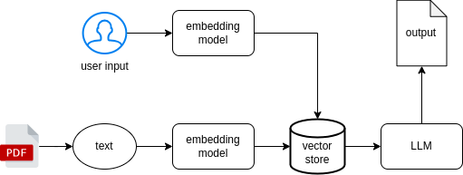

# Chatty ML Server

## Overview
챗봇 생성

## Architecture



## Skills
- Langchain
- FastAPI

## Usage
가상 환경 activate
```
source ./.env/bin/activate
```

필요한 패키지 다운로드
```
pip install -r requirements.txt
```

app 폴더로 이동
```
cd app
```

API 앱 실행
```
export OPENAI_API_KEY=your_openai_api_key_here
uvicorn app:app --reload
```

챗봇 클라이언트 실행
```
python3 main.py
```
---

### Docker

build
```shell
sudo docker build -t wequiz-model .
```

run
```shell
sudo docker run -p 8000:8000 --name wequiz-model wequiz-model
sudo docker run -e AWS_ACCESS_KEY_ID=your_access_key_id -e AWS_SECRET_ACCESS_KEY=your_secret_access_key -p 8000:8000 --name wequiz-model wequiz-model
```